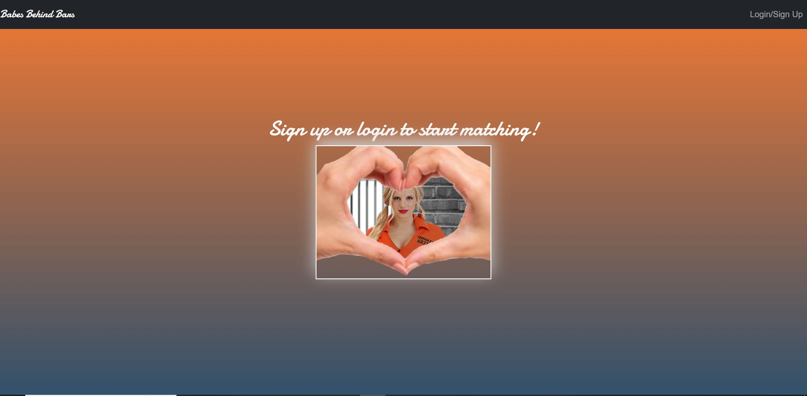
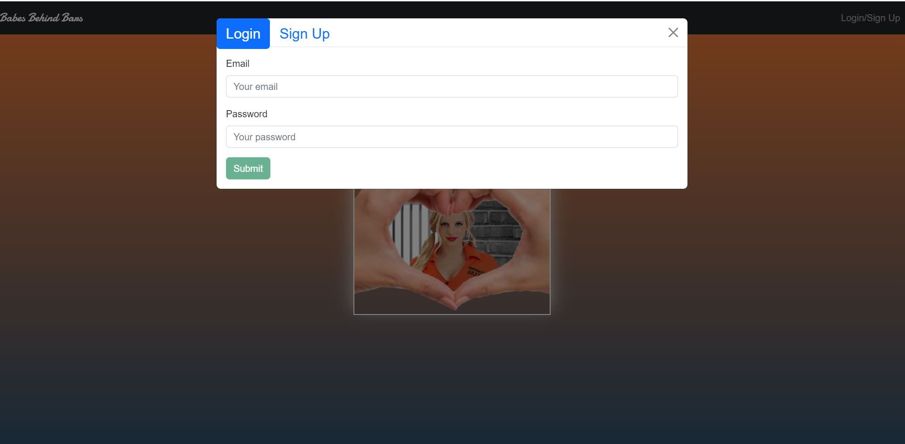
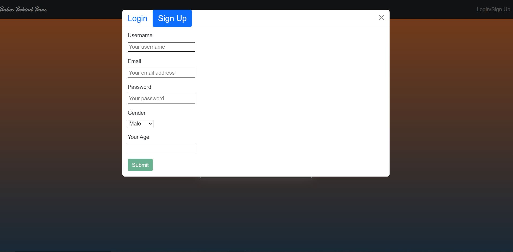

# Babes Behind Bars

[](https://opensource.org/licenses/MIT) 

## Table of Contents
- [Description](#description)
- [Installation](#installation)
- [Usage](#usage)
- [License](#license)
- [Contributing](#contributing)
- [Sources](#sources)
- [Questions](#questions)

## Description

Introducing a secure single-page online dating platform that combines the power of collaboration and the MERN stack technology to connect incarcerated individuals or those fascinated by the allure of 'bad boys' and 'bad girls.' This platform features a MongoDB backend, a GraphQL API, and an Express.js and Node.js server with a React front end that implements user authentication. Aditionally, Stripe payment platform.

## Installation

```bash
npm i 
```

## Usage

```bash
npm run seed
npm run build 
npm run develop
```

or

[Visit the website:](https://mugshawtys.herokuapp.com/)


Welcome

Login for existing users

Sign-up for new users

## License 
  ```
  MIT
  Copyright (c) undefined undefined
  
  Permission is hereby granted, free of charge, to any person obtaining a copy of this software and associated documentation files (the "Software"), to deal in the Software without restriction, including without limitation the rights to use, copy, modify, merge, publish, distribute, sublicense, and/or sell copies of the Software, and to permit persons to whom the Software is furnished to do so, subject to the following conditions:
  
  The above copyright notice and this permission notice shall be included in all copies or substantial portions of the Software.
  
  THE SOFTWARE IS PROVIDED "AS IS", WITHOUT WARRANTY OF ANY KIND, EXPRESS OR IMPLIED, INCLUDING BUT NOT LIMITED TO THE WARRANTIES OF MERCHANTABILITY, FITNESS FOR A PARTICULAR PURPOSE AND NONINFRINGEMENT. IN NO EVENT SHALL THE AUTHORS OR COPYRIGHT HOLDERS BE LIABLE FOR ANY CLAIM, DAMAGES OR OTHER LIABILITY, WHETHER IN AN ACTION OF CONTRACT, TORT OR OTHERWISE, ARISING FROM, OUT OF OR IN CONNECTION WITH THE SOFTWARE OR THE USE OR OTHER DEALINGS IN THE SOFTWARE.
```

## Contributing

> SHOUT OUT - We would like to give thanks to George Yoo for his substantial assistance during this project. 

This project does not currently have any external contributors.

## Sources

- [react-tinder-card-demo](https://github.com/3DJakob/react-tinder-card-demo.git)
- [mugshots-client](https://github.com/agaricide/mugshots-client)
- [useDApp](https://usedapp.io/)

## Questions 

If you have questions, you may contact any of the following contributors. 

- Daniel Liljegren 
[Email](mailto:dahneel@gmail.com) 
[Github](https://github.com/d-lil)

- Matt Moore
[Email](mailto:mattmoore2014@gmail.com) 
[Github](https://github.com/MattrMoore)

- Scott Schulman
[Email](mailto:scott.schulman84@gmail.com) 
[Github](https://github.com/itlleat)

- Saniyya McClendon 
[Email](mailto:saniyya.mcclendon@gmail.com) 
[Github](https://github.com/sanmcc)